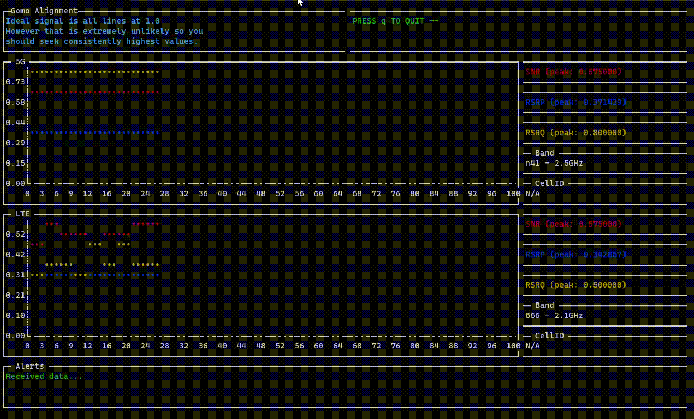
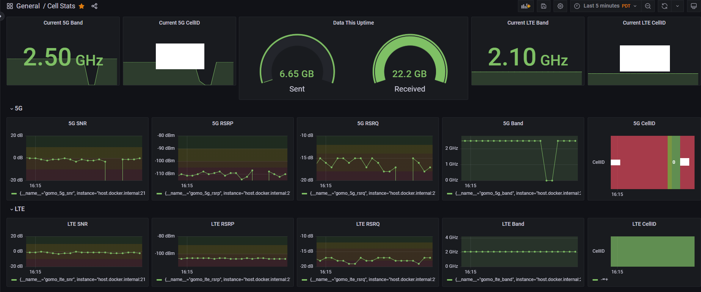

# GoMo

Tmobile trashcan datalogging for the original trashcan.

If you know, you know.

## Usage

```shell
 $ ./gomo --help
Fetch and log trashcan data to a long term data store for analyzing

Usage:
  gomo [command]

Available Commands:
  align       Continuously fetch data and display timeseries CLI charts
  completion  Generate the autocompletion script for the specified shell
  daemon      Daemonized Gomo which will continuously run
  help        Help about any command
  show        Do a single fetch and display
  version     retrieve version and build info for gomo

Flags:
      --config string     config file (default is $HOME/.gomo.yaml)
  -h, --help              help for gomo
  -u, --hostname string   hostname of your tmobile trashcan (default "http://192.168.12.1")
  -p, --targets strings   List of hostnames to target with ping test (default [www.google.com,github.com])
  -s, --timeout int       timeout in seconds for outbound requests (default 15)
  -t, --toggle            Help message for toggle
  -w, --workers int       number of workers for pingers (default 2)

Use "gomo [command] --help" for more information about a command.
```

## Quick Run

The quick run mode is accessible via the `show` command, and does a single pass and returns current values along with the results of a ping test.

```shell
$ gomo show --help
Do a single fetch and display.

Usage:
  gomo show [flags]

Flags:
  -h, --help     help for show
      --pretty   Print a prettified table layout instead of raw data

Global Flags:
      --config string     config file (default is $HOME/.gomo.yaml)
  -u, --hostname string   hostname of your tmobile trashcan (default "http://192.168.12.1")
  -p, --targets strings   List of hostnames to target with ping test (default [www.google.com,github.com])
  -s, --timeout int       timeout in seconds for outbound requests (default 15)
  -w, --workers int       number of workers for pingers (default 2)
```

```shell
=== Gomo 433a10b =======================
Online: 1
IPV6: redacted
Bytes Recv: 39627435316 (39.63GB)
Bytes Sent: 8446933064 (8.45GB)
=== 5G =================================
  Band:                n41
  CellID:              redacted

  SNR:                   6
  RSRP:               -102
  RSRQ:                -12
=== LTE ================================
  Band:                B66
  CellID:              redacted

  SNR:                   1
  RSRP:               -104
  RSRQ:                -16
  RSSI:                -69
=== Ethernet ===========================
  Enabled:               1
  Status:               Up

  Bytes Recv:4293117872 (4.29GB)
  Bytes Sent:4293117872 (4.29GB)
```

## Alignment

Alignment mode, accessible via `align` shows a continuous time series graph of LTE and 5G metrics to help align an antenna.

```shell
$ gomo align --help
Continuously fetch data and display timeseries CLI charts.
Useful for aligning antennas.

Usage:
  gomo align [flags]

Flags:
  -h, --help       help for align
  -x, --poll int   How often to fetch data and redraw (default 1)
  -z, --silent     Silence cell ID for screenshots (avoid leaking location data unintentionally)

Global Flags:
      --config string     config file (default is $HOME/.gomo.yaml)
  -u, --hostname string   hostname of your tmobile trashcan (default "http://192.168.12.1")
  -p, --targets strings   List of hostnames to target with ping test (default [www.google.com,github.com])
  -s, --timeout int       timeout in seconds for outbound requests (default 15)
  -w, --workers int       number of workers for pingers (default 2)
```



## Daemon datalogging

Daemon mode, accessible via `daemon` is a background process - meant to be run by a systemd unit. This continuously scrapes data from the trashcan and surfaces it on a /metrics endpoint for prometheus to scrape.

There is a rough prometheus/grafana setup configured with a dashboard meant for this data

```shell
$ gomo daemon --help
Daemonized Gomo which will continuously run and insert
discovered metrics into prometheus time series for graphing and
historical analysis.

Usage:
  gomo daemon [flags]

Flags:
  -h, --help       help for daemon
  -m, --port int   Port to bind metrics webserver to (default 2112)

Global Flags:

      --config string     config file (default is $HOME/.gomo.yaml)
  -u, --hostname string   hostname of your tmobile trashcan (default "http://192.168.12.1")
  -p, --targets strings   List of hostnames to target with ping test (default [www.google.com,github.com])
  -s, --timeout int       timeout in seconds for outbound requests (default 15)
  -w, --workers int       number of workers for pingers (default 2)
```



<!-- markdownlint-disable-next-line MD025 -->
# TODO

## High Priority

* Stub trashcan for tests with a fake json response
* Write tests

## Low Priority

* Tighten up prometheus/grafana deployment
* Docker container for gomo in docker-compose for quick launch
* Add internet speedtest metrics exporter
* Add ping metrics exporter
* Explore other cgi pages for more potential data points or metrics

<!-- markdownlint-disable-next-line MD025 -->
# Dependencies

* spf13/cobra
* spf13/viper
* davecgh/go-spew
* [TermUI](github.com/gizak/termui/v3)
* [Prometheus Client](github.com/prometheus/client_golang)
* [prometheus-community/pro-bing](https://github.com/prometheus-community/pro-bing)
  * provides a tool to ping remote hosts with windows support

<!-- markdownlint-disable-next-line MD025 -->
# Authors

* Charles Corbett <github.com/asciifaceman>

<!-- markdownlint-disable-next-line MD025 -->
# Thanks

* Karl Q
